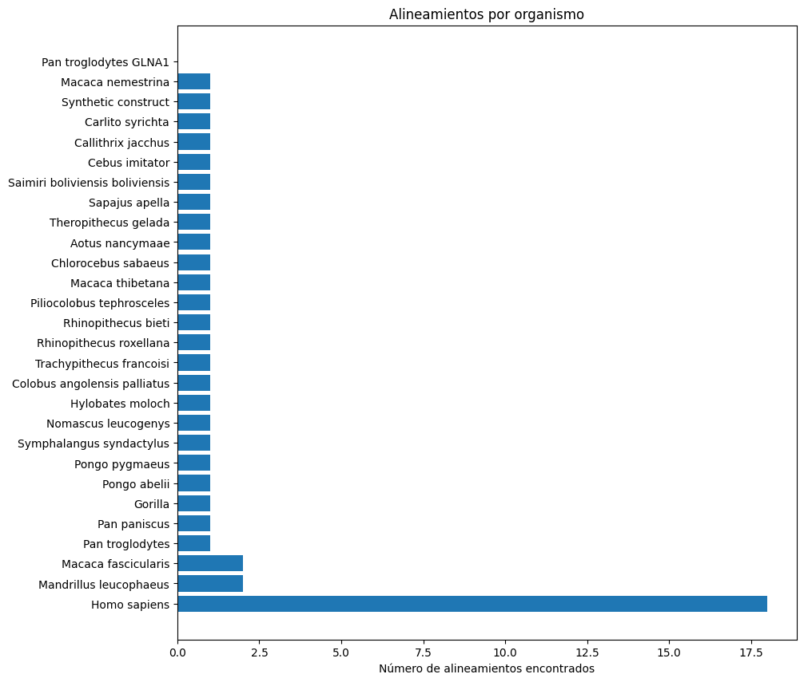
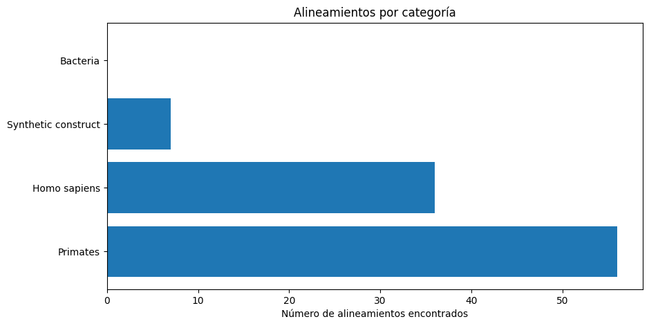
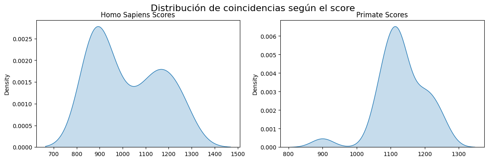

# Práctica 3: Alineamiento con BLAST (*Basic Local Alignment Search Tool*) y Biopython

**Participantes:**
- Ricardo Juan Cárdenes Pérez
- Susana Suárez Mendoza

<div align="justify">

Esta práctica consta de tres ejercicios que ponen en práctica la búsqueda mediente la busqueda BLAST de una secuencia mediante Biopython de forma *online* y *offline*. 

## Instalación de BLAST de forma local

1. Se descarga la versión para el equipo de BLAST desde el siguiente enlace: [BLAST](https://ftp.ncbi.nlm.nih.gov/blast/executables/blast+/LATEST/)
2. Se ejecuta, en nuestro caso, el .exe descargado y se instala en el equipo.
3. Se configura el path de BLAST como variable de entorno del sistema.
4. Se verifica la instalación con el comando blastn --version.
5. Los diversos ejercicios necesitarán las rutas correspondientes a:
   - La ruta del ejecutable de BLAST según la naturaleza, por ejemplo, blastn o blastp.
   - La ruta de la base de datos que se quiera utilizar.

## Ejercicio 1:

Escribe un programa en Python que use Biopython para hacer una búsqueda BLAST de una secuencia de ADN que introduzcas por teclado. El programa debe mostrar por pantalla el número de resultados obtenidos, el E-value del mejor resultado y la descripción de la secuencia más similar. Hágalo de forma online y local.

**1. Obtención de la secuencia introducida por teclado**

En este apartado se depura la secuencia de ADN introducida por el usuario (`get_sequence()`):
- Se suprimen los espacios: `check_no_spaces(sequence)`
- Se traduce a mayúsculas: `sequence_upper(sequence)`
- En el caso de que se contenga cualquier otra *string* que no corresponda a un nucleótido o la longitud de la secuencia sea 0, se lanzará una excepción.

```python
def get_sequence():
    sequence = input("Introduce la secuencia de ADN: ").strip()
    sequence = check_sequence(sequence)
    return sequence

def check_sequence(sequence):
    sequence = check_no_spaces(sequence)
    sequence = sequence_upper(sequence)
    if not check_nucleotides_DNA(sequence) and len(sequence) == 0:
        raise ValueError("Invalid DNA sequence")
    return sequence
```

**2. Implementación *online***

Se crea la función `search_online_sequence`, la cual es la encargada de realizar lo siguiente:
- Obtención de la secuencia: `get_sequence()`
- Realizar la búsqueda BLAST *online*: `NCBIWWW.qblast("blastn", "nt", sequence)` donde "blastn" es el tipo de búsqueda BLAST que se realiza, y se utiliza para comparar secuencias de nucleótidos (ADN o ARN), "nt" es la base de datos de nucleótidos en la que se va a buscar la secuencia y sequence es la secuencia genética que queremos comparar.
- Obtención de los valores y mostrarlos por pantalla.

```python
def search_online_sequence():
    sequence = get_sequence()

    result = NCBIWWW.qblast("blastn", "nt", sequence)
    blast_records = NCBIXML.read(result)
    
    if not blast_records.alignments:
        print("No se encontraron resultados.")

    # La lista blast_records.alignments contiene todos los alineamientos encontrados
    num_results = len(blast_records.alignments)

    best_alignment = blast_records.alignments[0] # primer alineamiento de la lista de alineamientos (generalmente el mejor)
    best_hsp = best_alignment.hsps[0] # High-scoring Segment Pair que es una comparación entre sub-secuencias de la consulta y la base de datos
    e_value = best_hsp.expect # obtención del e-value del mejor alineamiento
    description = best_alignment.title # descripción del mejor alineamiento
    
    print("\nResultados BLAST:")
    print(f"Número de resultados: {num_results}")
    print(f"E-value del mejor resultado: {e_value}")
    print(f"Descripción de la secuencia más similar: {description}")
```

**3. Implementación *offline***

Se realiza la búsqueda local mediante dos bases de datos de BLAST, disponibles en el NCBI (*National Center for Biotechnology Information*):
- **Base de datos `human_genome`**: Base de datos de ensamblaje actual del genoma humano refseq (GRCh). [Información disponible](https://www.ncbi.nlm.nih.gov/books/NBK62345/#blast_ftp_site.The_blastdb_subdirectory)
- **Base de datos `core_nt`**:  La base de datos core_nt es nt sin la mayoría de las secuencias de cromosomas eucariotas. La mayoría de las búsquedas BLAST de nucleótidos con core_nt serán similares a las de la base de datos nt. Sin embargo, core_nt es mejor que nt para alcanzar los objetivos de búsqueda BLAST más comunes, como la identificación de secuencias relacionadas con genes, como secuencias de transcripción y cromosomas bacterianos completos. Esto se debe a que, en los últimos años, nt ha adquirido más contenido de baja relevancia, no anotado y no génico. Para esta base de datos, debido a las limitaciones de recursos, se han descargado los archivos desde el 00 al 20. [Información disponible](https://bioinformaticsonline.com/news/view/44640/new-blast-core-nucleotide-database-core-nT)

```python
def search_local_sequence():
    # Rutas necesarias para la búsqueda
    os.environ["CMD"] = input("Introduce la ruta del ejecutable de BLAST: ")
    os.environ["BLASTDB"] = input("Introduce la ruta de la base de datos de BLAST: ")

    # Obtención de la secuencia
    sequence = get_sequence()

    # Escribir la frecuencia para realizar la búsqueda
    fasta_file = "query.fasta"
    with open(fasta_file, "w") as f:
        f.write(">query\n")
        f.write(sequence)

    # Configuración y ejecución de la línea de comando BLAST
    blastn_cline = NcbiblastnCommandline(
        cmd=os.environ["CMD"],
        query=fasta_file,
        db=os.environ["BLASTDB"],
        evalue=0.001,
        outfmt=5,
        out="results.xml"
    )

    blastn_cline()

    # Leer y procesar los resultados de BLAST de forma similar a la ejecución online
    with open("results.xml") as result_handle:
        blast_records = NCBIXML.parse(result_handle)
        for blast_record in blast_records:
            if blast_record.alignments:
                print(f"Número de resultados: {len(blast_record.alignments)}")

                best_alignment = blast_record.alignments[0]
                best_hsp = best_alignment.hsps[0]
                print(f"E-value del mejor resultado: {best_hsp.expect}")
                print(f"Descripción del mejor resultado: {best_alignment.title}")
            else:
                print("No se encontraron coincidencias.")

    # Eliminar los archivos temporales
    os.remove(fasta_file)
    os.remove("results.xml")
```

**4. Comparación de la implementación local vs *online***

Debido a las limitaciones de recursos, se decide comparar los resultados entre las diversas bases de datos, puesto que la implementación online utiliza la base de datos completa de `nt` y la en implementación local, únicamente se dispone de un subconjunto de la base de datos `core_nt` y `human_genome`. Además, se comparará el tiempo de ejecución entre las implementaciones.

Para ello, se decide alinear mediante BLAST parte de una secuencia conocida que corresponde al gen de la hemoglobina:
...`TACTGCCCTGTGGGGCAAGGTGAACGTGGATGAAGTTGGTGGTGAGGCCCTGGGCAGGTTGGTATCAAGGTTACAAGACAGGTTGCTGGTGGTCTACCCTT`...

En definitiva, la implementación local con la base de datos core_nt es la que más se aproxima a la versión en línea, ya que realiza búsquedas en parte de la base de datos nt. En cambio, la base de datos human_genome genera menos resultados, debido a su enfoque específico en el genoma humano.
Sin embargo, la búsqueda local, debido a la falta de recursos, es la que más tarda. Por lo que las búsquedas locales se deben realizar en el caso de que se dispongan de los recursos necesarios.

<div align="center">
<table border="1" style="border-collapse: collapse; text-align: center;">
  <thead>
    <tr>
      <th>Implementación</th>
      <th>Tiempo de ejecución (s)</th>
    </tr>
  </thead>
  <tbody>
    <tr>
      <td>online</td>
      <td>67.487276</td>
    </tr>
    <tr>
      <td>local human genome</td>
      <td>19.800459</td>
    </tr>
    <tr>
      <td>local subconjunto core_nt</td>
      <td>524.341397</td>
    </tr>
  </tbody>
</table>
   <p><b>Tabla 1.</b> Tiempos de ejecución de la búsqueda en bases de datos locales</p>
</div>

<hr>

## Ejercicio 2:

Escribe un programa en Python que use Biopython para hacer una búsqueda BLAST de una secuencia de proteína que introduzcas por teclado. El programa debe guardar en un fichero los resultados que tengan un E-value menor que 0.001. El fichero debe contener el identificador, la longitud, el E-value y el porcentaje de identidad de cada resultado. Hágalo de forma online y local.

**1. Obtención de la secuencia introducida por teclado**

De forma similar al ejercicio 1, se depura la secuencia de aminoácidos introducida por el usuario con la salvedad de que en lugar de comprobar nucleótidos se comprueban aminoácidos:

```python
def check_protein(sequence):
    sequence = check_no_spaces(sequence)
    sequence = sequence_upper(sequence)
    if not check_aminoacids_protein(sequence) and len(sequence) == 0:
        raise ValueError("Invalid protein sequence")
    return sequence

def get_protein():
    protein = input("Enter the protein sequence: ")
    protein = check_protein(protein)
    return protein
```

**2. Implementación *online***

Se crea la función `search_protein_sequence`, la cual es la encargada de realizar lo siguiente:
- Obtención de la secuencia de aminoácidos: `get_protein()`
- Realizar la búsqueda BLAST *online*: `NCBIWWW.qblast("blastp", "nr", protein_sequence)` donde "blastp" indica que se está realizando una búsqueda de proteínas (BLAST para proteínas), "nr" se refiere a la base de datos de proteínas non-redundantes (NR) proporcionada por NCBI, que contiene un gran número de secuencias proteicas de diversas especies y "protein_sequence" es la secuencia proteica que se está buscando en la base de datos.
- Filtrado de los resultados y guardar los atributos necesarios en formato JSON. Enlace a la documentación: [BLAST Record](https://biopython.org/docs/1.75/api/Bio.Blast.NCBIWWW.html)

```python
def search_protein_sequence(output_file="./results/blast_results.json"):

    protein_sequence = get_protein()

    result_handle = NCBIWWW.qblast("blastp", "nr", protein_sequence)
    blast_records = NCBIXML.parse(result_handle)

    filtered_results = []

    for blast_record in blast_records:
        for alignment in blast_record.alignments:
            for hsp in alignment.hsps:
                # Filtrar los resultados según el E-value
                if hsp.expect < 0.001:
                    # Guardar los atributos requeridos en formato JSON
                    result = {
                        "id": alignment.hit_id,
                        "length": alignment.length,
                        "evalue": hsp.expect,
                        "identity_percentage": (hsp.identities / hsp.align_length) * 100
                    }
                    filtered_results.append(result)

    # Guardar en el archivo
    with open(output_file, "w") as f:
        json.dump(filtered_results, f, indent=4)

    print(f"Resultados guardados en formato JSON en: {output_file}")
```

**3. Implementación *offline***

Al igual que en e ejercicio 1, se realiza la búsqueda local mediante dos bases de datos de BLAST, disponibles en el NCBI (*National Center for Biotechnology Information*):
- **Base de datos `swisprot`**: repositorio de secuencias de proteínas que forma parte de la base de datos UniProt.
- **Base de datos `nr`**:  base de datos no redundante de secuencias de proteínas. Debido a las limitaciones de recursos, se han descargado únicamente los archivos desde el 000 al 020.

```python
def search_local_protein(output_file = "./results/blast_results_locally.json"):
    # Rutas necesarias para la búsqueda
    os.environ["CMD"] = input("Introduce la ruta del ejecutable de BLAST: ")
    os.environ["BLASTDB"] = input("Introduce la ruta de la base de datos de BLAST: ")

    # Obtención de la secuencia
    sequence = input("Introduce la secuencia de proteína en formato FASTA: ")

    # Escribir la frecuencia para realizar la búsqueda
    fasta_file = "query.fasta"
    with open(fasta_file, "w") as f:
        f.write(">query\n")
        f.write(sequence)


    # Configuración y ejecución de la línea de comando BLAST
    blastp_cline = NcbiblastpCommandline(
        cmd=os.environ["CMD"],
        query=fasta_file,
        db=os.environ["BLASTDB"],
        evalue=0.001,
        outfmt=5,
        out="results.xml"
    )

    blastp_cline()


    with open("results.xml") as result_handle:
        blast_records = NCBIXML.parse(result_handle)
        filtered_results = []

        for blast_record in blast_records:
            for alignment in blast_record.alignments:
                for hsp in alignment.hsps:
                    # Filtrar los resultados según el E-value
                    if hsp.expect < 0.001:
                        # Guardar los atributos necesarios
                        result = {
                            "id": alignment.hit_id,
                            "length": alignment.length,
                            "evalue": hsp.expect,
                            "identity_percentage": (hsp.identities / hsp.align_length) * 100
                        }
                        filtered_results.append(result)

    # Guardar en el archivo
    with open(output_file, "w") as f:
        json.dump(filtered_results, f, indent=4)

    print(f"Resultados guardados en formato JSON en: {output_file}")

    os.remove(fasta_file)
    os.remove("results.xml")
```

**4. Comparación de la implementación local vs *online***

Al igual que el ejercicio 1, se ha decidido realizar una comparativa entre la implementación local y online. Para ello, se utilizará parte de la secuencia de aminoácidos correspondiente a la proteína de la insulina humana.

...`LVEALYLVCGERGFFYTPKTRREAEDLQVGQVELGGGP`...

En este caso, lo único que se puede comparar es el tiempo de ejecución, ya que los resultados más fiables se consideran los correspondientes a la base de datos online puesto que es la que más información contiene. Por tanto, la ejecución local en la base de datos de Swissprot es la más rápida puesto que es aquella que contiene menos información. Sin embargo, a pesar de que la online es la que más tarda, a su vez es la más completa puesto que realiza la bñusqueda en toda la base de datos de proteínas `nr`. En definitiva, si se busca una mayor precisión, se recomienda la búsqueda online, mientras que si se busca rapidez, se recomienda la búsqueda local en la base de datos de Swissprot. Además, si se disponen de los recursos necesarios, la base de datos `nr` de forma local y completa también es una buena opción.

<div align="center">
<table border="1" style="border-collapse: collapse; text-align: center;">
  <thead>
    <tr>
      <th>Implementación</th>
      <th>Tiempo de ejecución (s)</th>
    </tr>
  </thead>
  <tbody>
    <tr>
      <td>online</td>
      <td>363.872967</td>
    </tr>
    <tr>
      <td>local swissprot</td>
      <td>14.235358</td>
    </tr>
    <tr>
      <td>local nr subset</td>
      <td>332.662034</td>
    </tr>
  </tbody>
</table>
   <p><b>Tabla 2.</b> Tiempos de ejecución de la búsqueda en bases de datos locales</p>
</div>

<hr>

## Ejercicio 3:


Escribe un programa en Python que use Biopython para hacer una búsqueda BLAST de una secuencia de ADN que leas de un fichero en formato FASTA. El programa debe hacer la búsqueda en la base de datos nr y filtrar los resultados por el organismo que elijas. El programa debe mostrar por pantalla el número de resultados obtenidos y el E-value medio de los mismos. Hágalo de forma online y local.

**1. Obtención de una secuencia de nucleótidos**

Para este apartado, seguiremos una aproximación similar a la seguida en las prácticas anteriores. Así, obtendremos los ficheros FASTA directamente de los servidores de NCBI mediante el módulo Entrez de Biopython. Para ello, se ha implementado la clase `FastaDataLoader`, que agrupa toda la lógica necesaria para poder lograr el objetivo. Siguiendo unos buenos patrones de diseño, se ha implementado el Fatory Method, el cual permite instanciar varios tipos de data loaders mediante la clase `DataLoaderFactory`.

Para el caso que compete, haremos uso de esta clase para instanciar un objeto `FastaDataLoader` para, acto seguido, obtener un fichero FASTA y la secuencia con identificador NM_000518.5, que se corresponde con la codificación en nucleotidos de la subunidad B de la hemoglobina humana.

```python
from processing.data_loader import DataLoaderFactory
sequence = DataLoaderFactory.get_loader('api').load(('NM_000518.5',), 'nucleotide')
```

Se consigue así obtener la secuencia de nucleótidos que será útil para la práctica.

```text
>NM_000518.5 Homo sapiens hemoglobin subunit beta (HBB), mRNA
ACATTTGCTTCTGACACAACTGTGTTCACTAGCAACCTCAAACAGACACCATGGTGCATCTGACTCCTGA
GGAGAAGTCTGCCGTTACTGCCCTGTGGGGCAAGGTGAACGTGGATGAAGTTGGTGGTGAGGCCCTGGGC
AGGCTGCTGGTGGTCTACCCTTGGACCCAGAGGTTCTTTGAGTCCTTTGGGGATCTGTCCACTCCTGATG
CTGTTATGGGCAACCCTAAGGTGAAGGCTCATGGCAAGAAAGTGCTCGGTGCCTTTAGTGATGGCCTGGC
TCACCTGGACAACCTCAAGGGCACCTTTGCCACACTGAGTGAGCTGCACTGTGACAAGCTGCACGTGGAT
CCTGAGAACTTCAGGCTCCTGGGCAACGTGCTGGTCTGTGTGCTGGCCCATCACTTTGGCAAAGAATTCA
CCCCACCAGTGCAGGCTGCCTATCAGAAAGTGGTGGCTGGTGTGGCTAATGCCCTGGCCCACAAGTATCA
CTAAGCTCGCTTTCTTGCTGTCCAATTTCTATTAAAGGTTCCTTTGTTCCCTAAGTCCAACTACTAAACT
GGGGGATATTATGAAGGGCCTTGAGCATCTGGATTCTGCCTAATAAAAAACATTTATTTTCATTGCAA
```

**2. Búsqueda online en la base de datos**

Dado que **nr** es una base de datos de proteínas, y que disponemos de una secuencia de nucleótidos para hacer la búsqueda, debemos utilizar la orden **blastx** para realizarla. Mientras que **blastn** es útil para buscar similitudes entre secuencias de **nucleótidos**, **blastx** traduce la secuencia de nucleótidos en las seis posibles fases de lectura y compara esas secuencias traducidas contra una base de datos de proteínas, como **nr**.

Esto es especialmente útil cuando la secuencia de nucleótidos representa un gen potencial o una región codificante, ya que permite identificar proteínas homólogas o conservadas, facilitando la anotación funcional de la secuencia analizada. Por el contrario, **blastn** es más adecuado para buscar regiones similares a nivel de ADN o ARN, como en estudios de genómica comparativa o para identificar secuencias homólogas en bases de datos genómicas. Algo análogo ocurre con **blastp**.

Para realizar la búsqueda, se tiene la siguiente lógica en python:

```python
def search_online_sequence(sequence, organism_filter):
    result = NCBIWWW.qblast("blastx", "nr", sequence)
    blast_records = NCBIXML.read(result)

    print(f"Resultados BLAST para la secuencia sin filtrar por organismo:")
    print(f"Número de alineamientos: {len(blast_records.alignments)}")

    best_alignment = blast_records.alignments[0]
    best_hsp = best_alignment.hsps[0]
    e_value = best_hsp.expect
    description = best_alignment.title

    print(f"E-value del mejor resultado: {e_value}")
    print(f"Descripción de la secuencia más similar: {description}")

    if not blast_records.alignments:
        print("No se encontraron resultados.")
        return
    
    filtered_alignments = []
    for alignment in blast_records.alignments:
        if organism_filter.lower() in alignment.title.lower():
            filtered_alignments.append(alignment)

    if not filtered_alignments:
        print(f"No se encontraron resultados para el organismo '{organism_filter}'.")
        return
    
    num_results = len(filtered_alignments)
    
    best_alignment = filtered_alignments[0]
    best_hsp = best_alignment.hsps[0]
    e_value = best_hsp.expect
    description = best_alignment.title
    
    print("\nResultados BLAST filtrados por organismo:")
    print(f"Número de resultados: {num_results}")
    print(f"E-value del mejor resultado: {e_value}")
    print(f"Descripción de la secuencia más similar: {description}")
```

```python
search_online_sequence(sequence, 'Homo sapiens')
```

```text
Resultados BLAST para la secuencia sin filtrar por organismo:
Número de alineamientos: 50
E-value del mejor resultado: 9.36386e-102
Descripción de la secuencia más similar: gb|AAX37051.1| hemoglobin beta, partial [synthetic construct]
```

En efecto, se ha encontrado la secuencia que se buscaba. Con objetivo de añadir más complejidad a la búsqueda, se prueba a introducir mutaciones en la secuencia de consulta. Se obtiene lo siguiente:

- Para un $2.38\%$ de la secuencia mutada, se obtiene:

```text
Resultados BLAST para la secuencia sin filtrar por organismo:
Número de alineamientos: 50
E-value del mejor resultado: 0.0
Descripción de la secuencia más similar: gi|1401724401|ref|NM_000518.5| Homo sapiens hemoglobin subunit beta (HBB), mRNA

Resultados BLAST filtrados por organismo:
Número de resultados: 17
E-value del mejor resultado: 0.0
Descripción de la secuencia más similar: gi|1401724401|ref|NM_000518.5| Homo sapiens hemoglobin subunit beta (HBB), mRNA
```


- Para un $30\%$ de la secuencia mutada, se obtiene:

```text
Resultados BLAST para la secuencia sin filtrar por organismo:
Número de alineamientos: 50
E-value del mejor resultado: 6.57607e-44
Descripción de la secuencia más similar: pdb|1GBV|B Chain B, HEMOGLOBIN [Homo sapiens] >pdb|1GBV|D Chain D, HEMOGLOBIN [Homo sapiens]

Resultados BLAST filtrados por organismo:
Número de resultados: 28
E-value del mejor resultado: 6.57607e-44
Descripción de la secuencia más similar: pdb|1GBV|B Chain B, HEMOGLOBIN [Homo sapiens] >pdb|1GBV|D Chain D, HEMOGLOBIN [Homo sapiens]
```

Aunque se trate de una versión distinta, seguimos observando que la mejor alineación corresponde a la **subunidad beta de la hemoglobina humana**. Además, el alineamiento presenta un **e-value muy bajo**, lo que refuerza la alta confianza estadística en el resultado obtenido.

#### Interpretación de los resultados

Este hallazgo es especialmente relevante, ya que, a pesar de haber introducido más del **30% de mutaciones** en la secuencia, la mejor alineación sigue correspondiendo a la misma proteína. Esto sugiere una notable **resiliencia evolutiva y versatilidad funcional** de la hemoglobina beta, una característica esencial para su papel en el transporte de oxígeno en el cuerpo humano.

La capacidad de tolerar un alto porcentaje de mutaciones mientras mantiene su alineación con la hemoglobina humana nos brinda dos importantes conclusiones:

1. **Robustez de la estructura y función proteica**: La hemoglobina beta parece conservar su estructura tridimensional y su capacidad funcional incluso ante modificaciones significativas en la secuencia primaria. Esto implica que las mutaciones no afectan de forma drástica los sitios funcionales clave, como los que interactúan con el oxígeno o con otras subunidades de la hemoglobina.

2. **Evolución y adaptabilidad**: La alta tolerancia a las mutaciones podría reflejar un diseño evolutivo que permite cierto grado de variabilidad genética sin comprometer la función proteica. Esto es coherente con su importancia fisiológica, ya que cualquier pérdida significativa de función sería incompatible con la vida.

#### Aplicaciones y perspectivas

Este resultado abre interesantes líneas de investigación:
- **Diseño de proteínas**: La tolerancia a mutaciones podría aprovecharse en biotecnología y medicina para diseñar versiones de la hemoglobina con propiedades específicas, como una mayor afinidad al oxígeno en situaciones de hipoxia.
- **Estudios de estabilidad estructural**: Profundizar en cómo las mutaciones afectan o no la estabilidad de la proteína podría revelar nuevas estrategias para desarrollar terapias basadas en proteínas resistentes a mutaciones patogénicas.
- **Análisis de enfermedades genéticas**: Estas observaciones pueden proporcionar nuevas perspectivas sobre las mutaciones que provocan hemoglobinopatías, como la anemia falciforme, ayudando a distinguir entre mutaciones benignas y aquellas que afectan la función crítica de la proteína.

 Ahora bien, era bastante probable que, partiendo de una secuencia de nucleotidos ya existente en las bases de datos de NCBI, se obtiese como resultado de búsqueda esa misma secuencia, por lo que el organismo resultante coincidiría con el de la consulta. No obstante, el alineamiento mostrado no es el único buen alineamiento que se ha obtenido ni mucho menos. De hecho, la búsqueda ha detectado otras 50 alternativas las cuales son candidatas a ser la coincidente con la secuencia de consulta. Veamos los resultados obtenidos visualmente en la Figura 1.

 <div align="center">
      
       <p><b>Figura 1.</b> Cantidad de alineamtientos encontrados por organismo</p>
 </div>

Como se aprecia en la gráfica, existe una gran cantidad de organismos para los que se ha encontrado un posible alineamiento, que resultan ser distintos al Homo Sapiens. Tal y como se aprecia en la gráfica, los organismos en los que más alineamientos se han encontrado, después de en los humanos, son:
- **Mandrillus leucophaeus**: una especie de primate catarrino de la familia Cercopithecidae similar en apariencia al mandril, pero sin la cara vivamente coloreada de este. Se encuentra en los bosques de Camerún, Nigeria y en la isla de Bioko, en Guinea Ecuatorial.
- **Macaca fascicularis**: una especie de primate catarrino de la familia Cercopithecidae. Se encuentra principalmente en Indonesia, Filipinas y Malasia, así como en las islas Andamán.

Pese a no ser este el organismo al que pertenece la secuencia de nucleótidos buscada, estos son realmente parecidos a los humanos. De hecho, la gran mayoría de organismos encontrados se corresponden a distintas especies de primates, por lo que tiene sentido tantos alineamientos para tan diversas especies. Si agrupamos todas ellas en categorías, obtenemos lo mostrado en la Figura 2.

 <div align="center">
      
       <p><b>Figura 2.</b> Cantidad de alineamtientos encontrados por grupo de organismos</p>
 </div>

Esto es sorprendente. Parece ser que existen bastantes similitudes entre las subunidades beta de la hemoglobina tanto en humanos como en primates. Este resultado no solo tiene implicaciones funcionales, sino también un claro significado **evolutivo**, ya que resalta la conservación de una proteína clave para la supervivencia en especies con un ancestro común relativamente reciente. 

Sin embargo, al analizar los resultados más de cerca, observamos un comportamiento curioso: aunque ahora parece haber **más alineamientos con las secuencias humanas** que con las de primates, esto no implica necesariamente que todos esos alineamientos sean de alta calidad. Es razonable suponer que los alineamientos con la hemoglobina humana serían, en promedio, **mejores** que los observados en otras categorías, como los primates. Sorprendentemente, esto no es del todo cierto. De hecho, esto se muestra justo en la Figura 3.

 <div align="center">
      
       <p><b>Figura 3.</b> Distribución de scores obtenidos por alineamientos</p>
 </div>


Esto sugiere que, aunque la hemoglobina en humanos ha mantenido una notable homología con la de primates, también ha experimentado cambios específicos que pueden haber alterado ciertos aspectos de su secuencia sin comprometer la función. Estos resultados invitan a reflexionar sobre cómo, a pesar de las diferencias puntuales, la **presión selectiva** ha preservado las características esenciales de la hemoglobina beta en humanos y primates, garantizando su funcionalidad en ambos grupos. 

### Perspectiva evolutiva
El patrón observado podría deberse a eventos específicos de la **divergencia evolutiva** entre humanos y primates, donde pequeñas modificaciones en la secuencia han permitido adaptaciones sutiles a entornos o fisiologías particulares. Por otro lado, la falta de alineamientos sobresalientes en todas las categorías podría reflejar la presencia de regiones en la proteína que no están sujetas a una alta presión selectiva, permitiendo mayor variabilidad sin afectar su desempeño.

**3. Implementación local**

Para realizar la búsqueda en la base de datos, se implementa la misma lógica que la de los ejercicios anteriores. Sin embargo, esta vez se hace uso del comando `blastx` en lugar de `blastp` o `blastn`, por los motivos ya comentados en la sección anterior.

```python
def search_local_protein(output_file = "./results/blast_results_locally.json"):
    os.environ["BLASTDB"] = input("Introduce la ruta de la base de datos de BLAST: ")
    database = input("Introduce la base de datos donde buscar (ej. nr):")
    fasta = input("Introduce la ruta del fichero fasta:")

    blastx_cline = NcbiblastxCommandline(
        query=fasta,
        db=database,
        evalue=0.001,
        outfmt=5,
        out="results.xml"
    )

    blastx_cline()
    print('Búsqueda realizada')


    with open("results.xml") as result_handle:
        blast_records = NCBIXML.parse(result_handle)
        filtered_results = []

        for blast_record in blast_records:
            for alignment in blast_record.alignments:
                for hsp in alignment.hsps:
                    if hsp.expect < 0.001:
                        result = {
                            "id": alignment.hit_id,
                            "length": alignment.length,
                            "evalue": hsp.expect,
                            "identity_percentage": (hsp.identities / hsp.align_length) * 100
                        }
                        filtered_results.append(result)

    with open(output_file, "w") as f:
        json.dump(filtered_results, f, indent=4)

    print(f"Resultados guardados en formato JSON en: {output_file}")
```

Se ha probado a hacer uso de las bases de datos nr (con las particiones del 0 al 20 debido a las restricciones computacionales de nuestros equipos) y swissprot. Los tiempos de ejecución medidos son los motrados en la Tabla 3.

<div align="center">
<table border="1" style="border-collapse: collapse; text-align: center;">
  <thead>
    <tr>
      <th>Implementación</th>
      <th>Tiempo de ejecución (s)</th>
    </tr>
  </thead>
  <tbody>
    <tr>
      <td>online</td>
      <td>363.872967</td>
    </tr>
    <tr>
      <td>local swissprot</td>
      <td>34.22</td></td>
    </tr>
    <tr>
      <td>local nr subset</td>
      <td>1882.99</td>
    </tr>
  </tbody>
</table>
<p><b>Tabla 3.</b> Tiempos de ejecución de la búsqueda en bases de datos locales</p>
</div>

En cuanto a los resultados, obtenemos lo siguiente. Analizando los ficheros del directorio `results` (`nr_results.xml` y `swissprot_results.xml`), podemos apreciar cómo ambas encuentran, como mejor alineamiento, la subunidad de la hemoglobina buscada. De hecho, aunque se trate de bases de datos diferentes, las proteínas encontradas son exactamente las mismas en cuanto a aminoácidos se refiere.

Por un lado, en `nr_results.xml` se da como mejor alineamiento el siguiente:

```xml
<Hit>
  <Hit_num>1</Hit_num>
  <Hit_id>gb|AAA88054.1|</Hit_id>
  <Hit_def>beta-globin [Homo sapiens] &gt;gb|AAF00489.1| hemoglobin beta subunit variant [Homo sapiens]</Hit_def>
  <Hit_accession>AAA88054</Hit_accession>
  <Hit_len>147</Hit_len>
  <Hit_hsps>
    <Hsp>
      <Hsp_num>1</Hsp_num>
      <Hsp_bit-score>298.901</Hsp_bit-score>
      <Hsp_score>764</Hsp_score>
      <Hsp_evalue>1.25207e-100</Hsp_evalue>
      <Hsp_query-from>51</Hsp_query-from>
      <Hsp_query-to>491</Hsp_query-to>
      <Hsp_hit-from>1</Hsp_hit-from>
      <Hsp_hit-to>147</Hsp_hit-to>
      <Hsp_query-frame>3</Hsp_query-frame>
      <Hsp_hit-frame>0</Hsp_hit-frame>
      <Hsp_identity>146</Hsp_identity>
      <Hsp_positive>146</Hsp_positive>
      <Hsp_gaps>0</Hsp_gaps>
      <Hsp_align-len>147</Hsp_align-len>
      <Hsp_qseq>MVHLTPEEKSAV...</Hsp_hseq>
      <Hsp_qseq>MVHLTPEEKSAV...</Hsp_hseq>
      <Hsp_midline>MVHLTPEEKSAV...</Hsp_midline>
    </Hsp>
  </Hit_hsps>
</Hit>
```

Por otra parte, para la base de datos swissprot, se obtiene el siguiente resultado:

```xml
<Hit>
  <Hit_num>1</Hit_num>
  <Hit_id>sp|P68871.2|</Hit_id>
  <Hit_def>RecName: Full=Hemoglobin subunit beta; AltName: Full=Beta-globin; AltName: Full=Hemoglobin beta chain; Contains: RecName: Full=LVV-hemorphin-7; Contains: RecName: Full=Spinorphin [Homo sapiens] &gt;sp|P68872.2| RecName: Full=Hemoglobin subunit beta; AltName: Full=Beta-globin; AltName: Full=Hemoglobin beta chain [Pan paniscus] &gt;sp|P68873.2| RecName: Full=Hemoglobin subunit beta; AltName: Full=Beta-globin; AltName: Full=Hemoglobin beta chain [Pan troglodytes]</Hit_def>
  <Hit_accession>P68871</Hit_accession>
  <Hit_len>147</Hit_len>
  <Hit_hsps>
    <Hsp>
      <Hsp_num>1</Hsp_num>
      <Hsp_bit-score>301.212</Hsp_bit-score>
      <Hsp_score>770</Hsp_score>
      <Hsp_evalue>7.47508e-105</Hsp_evalue>
      <Hsp_query-from>51</Hsp_query-from>
      <Hsp_query-to>491</Hsp_query-to>
      <Hsp_hit-from>1</Hsp_hit-from>
      <Hsp_hit-to>147</Hsp_hit-to>
      <Hsp_query-frame>3</Hsp_query-frame>
      <Hsp_hit-frame>0</Hsp_hit-frame>
      <Hsp_identity>147</Hsp_identity>
      <Hsp_positive>147</Hsp_positive>
      <Hsp_gaps>0</Hsp_gaps>
      <Hsp_align-len>147</Hsp_align-len>
      <Hsp_qseq>MVHLTPEEKSA...</Hsp_qseq>
      <Hsp_hseq>MVHLTPEEKSA...</Hsp_hseq>
      <Hsp_midline>MVHLTPEEKSA...</Hsp_midline>
    </Hsp>
  </Hit_hsps>
</Hit>
```

Obviamente el valor de los parámetors cambia. Los E-values, los scores, y el resto de valores no tiene por qué coincidir. Sin embargo, se obtiene el mismo alineamiento como el mejor. Esto se tiene, claro está, debido a que la proteina para la cual nuestra secuencia codifica se tiene almacenada en la base de datos. Al haberle pasado la proteína entera a la BBDD, era practicamente seguro que algo así ocurriese. No obstante, si probamos con un fragmento únicamente de esta proteína (aproximadamente el 40% de la misma), obtenemos la proteína buscada.

```xml
<Hit>
  <Hit_num>1</Hit_num>
  <Hit_id>pdb|5SW7|B</Hit_id>
  <Hit_def>Chain B, Hemoglobin subunit beta [Homo sapiens]</Hit_def>
  <Hit_accession>5SW7_B</Hit_accession>
  <Hit_len>146</Hit_len>
  <Hit_hsps>
    <Hsp>
      <Hsp_num>1</Hsp_num>
      <Hsp_bit-score>163.696</Hsp_bit-score>
      <Hsp_score>413</Hsp_score>
      <Hsp_evalue>1.85431e-49</Hsp_evalue>
      <Hsp_query-from>3</Hsp_query-from>
      <Hsp_query-to>242</Hsp_query-to>
      <Hsp_hit-from>54</Hsp_hit-from>
      <Hsp_hit-to>133</Hsp_hit-to>
      <Hsp_query-frame>3</Hsp_query-frame>
      <Hsp_hit-frame>0</Hsp_hit-frame>
      <Hsp_identity>79</Hsp_identity>
      <Hsp_positive>79</Hsp_positive>
      <Hsp_gaps>0</Hsp_gaps>
      <Hsp_align-len>80</Hsp_align-len>
      <Hsp_qseq>VMGNPKVKAHGKKVLGAFSDGLAHLDNLKGTFATLSELHCDKLHVDPENFRLLGNVLVCVLAHHFGKEFTPPVQAAYQKV</Hsp_qseq>
      <Hsp_hseq>VMGNPKVKAHGKKVLGAFSDGLAHLDNLDGTFATLSELHCDKLHVDPENFRLLGNVLVCVLAHHFGKEFTPPVQAAYQKV</Hsp_hseq>
      <Hsp_midline>VMGNPKVKAHGKKVLGAFSDGLAHLDNL GTFATLSELHCDKLHVDPENFRLLGNVLVCVLAHHFGKEFTPPVQAAYQKV</Hsp_midline>
    </Hsp>
  </Hit_hsps>
</Hit>
```

</div>
